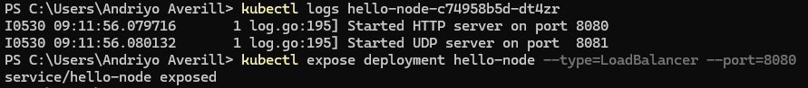
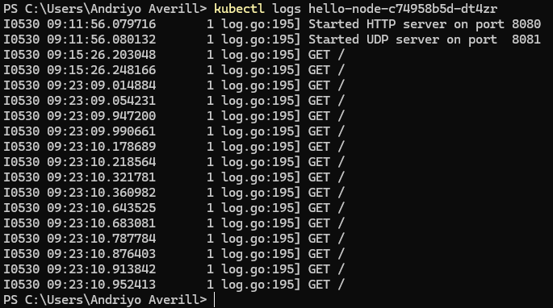

# Advanced Programming Rust 
by Andriyo Averill Fahrezi, NPM of 2306172325

## Module 11 - Deployment - Deployment on Kubernetes

### Reflection on Hello Minikube
- Logs Before : 

- Logs After : 

**1. Application Logs Comparison**

    Before the application was exposed as a service, its logs only showed **initial startup messages**, confirming that its HTTP and UDP servers were listening on their assigned ports.

    Once the application was exposed as a service and accessed via the proxy, the logs immediately began displaying HTTP **GET requests** to the root path (`/`). Each subsequent interaction, such as reloading or reopening the application, generated additional GET requests. For instance, initial access resulted in two GET requests, and two more reloads added four more, bringing the total to six.

    This clearly demonstrates that the service successfully **routes external traffic to the application's pod**, with each user interaction accurately reflected in the application's logs.

**2. Two versions of `kubectl get`**

    When using `kubectl get`, the `-n` option is crucial for specifying which namespace we want to query.

    **How Namespaces Affect `kubectl get`**

    -   If we run `kubectl get` without the `-n` option, it will display resources residing in the **default namespace**. This is typically where our pods and services are created if we don't explicitly define a namespace during their creation.

    -   However, if we use `kubectl get -n kube-system`, we'll see resources specifically within the `kube-system namespace`. This namespace is home to essential Kubernetes components, such as DNS services, proxies, and other control plane elements that are vital for the cluster's operation. we won't find our own applications' pods or services listed here because they exist in different namespaces. This separation highlights how namespaces provide vital isolation and organization for resources within a Kubernetes cluster.

    Commands like `kubectl get deployments` or `kubectl get pods` provide **real-time status** of our resources. To get even more specific information, we can always include the `-n <namespace>` option to target a particular namespace or add `-o wide` for additional details about the resources.